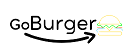

<!-- PROJECT LOGO -->
<br />
<p align="center">
  <a href="https://github.com/othneildrew/Best-README-Template">
    
  </a>

  <h3 align="center">REACT JS BURGER COMMERCE</h3>

  <p align="center">
    An BURGER COMMERCE with ReactJS, React-router-dom, json-server, React Animated CSS and Bootstrap !
    <br />
  </p>
</p>

<!-- ABOUT THE PROJECT -->
## About The Project

[![Product Name Screen Shot][product-screenshot]](https://example.com)

### Built With

This project build with.

* [ReactJS](https://reactjs.org/)
* [React Router Dom](https://reactrouter.com/)
* [json-server](https://www.npmjs.com/package/json-server)
* [React Animated CSS](https://www.npmjs.com/package/react-animated-css)
* [Bootstrap](https://getbootstrap.com/)


<!-- GETTING STARTED -->
## Getting Started
1. Clone the repo
 ```sh
   git clone https://github.com/wandskk/goburger.git
 ```
2. Go to project folder
 ```sh
   cd goburger
 ```
3. Install project requires
 ```sh
   npm install or npm i
 ```
4. Run React App
```sh
   npm start
 ```
5. Run json-server
```sh
   npm run backend
 ```
6. Access link
 ```sh 
    http://localhost:3000/
```

<!-- LICENSE -->
## License

Distributed under the MIT License. See `LICENSE` for more information.


<!-- CONTACT -->
## Contact
Project Link: [https://github.com/wandskk/goburger](https://github.com/wandskk/goburger)


[product-screenshot]: src/Assets/img/print.png
